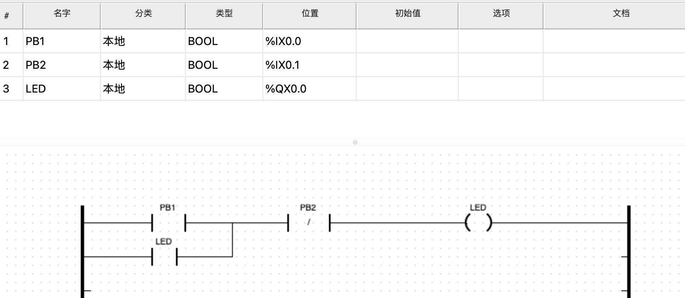

# week19-20240701-20240707

这周应该就是看了代码，确定了一下可能OpenPLC部分我需要改的东西并不多。

## OpenPLC的执行逻辑记录


main函数在 MAIN LOOP之前的部分，都是在初始化。这部分可以不需要管。

每一个while(run_openplc)循环都是在模拟一个scan time。


首先是处理输入数据的部分：

updateBuffersIn这个函数是会读取输入，具体来说会根据硬件平台的不同，有不同的读入方式。在hardware_layers文件夹中定义了不同的外设输入都是怎么做的。
updateCustomIn(); 这个函数的功能是把某些输入数据的值修改为特定的值。
updateBuffersIn_MB(); //update input image table with data from slave devices


另外我注意到，当输入为blank

然后是主要程序的部分：

```c
config_run__(__tick++);
```


这个函数是在Config0.c里实现的，因为用的样例程序比较小

```c
void config_run__(unsigned long tick) {
  RES0_run__(tick);
}
```

RES0就是写plc代码使用的文件，具体实现在Res0.c文件中。

在样例程序里面，只有一共LED灯，其他啥都没有。
```c
void RES0_run__(unsigned long tick) {
  TASK0 = !(tick % 1);
  if (TASK0) {
    PROGRAM0_body__(&INSTANCE0);
  }
}
```

这里TASK0是什么意思？

PROGRAM0_body__函数在POUS.c文件中得到定义。而这个就是真正的PLC逻辑了。

```c

#define __SET_LOCATED(prefix, name, suffix, new_value)\
	if (!(prefix name.flags & __IEC_FORCE_FLAG)) *(prefix name.value) suffix = new_value

// __SET_LOCATED的意思应该是把名字为LED的变量的值修改为new_value。
// 具体采用了什么技术我也没看明白orz

// Code part
void PROGRAM0_body__(PROGRAM0 *data__) {
  // Initialise TEMP variables

  __SET_LOCATED(data__->,LED,,__BOOL_LITERAL(TRUE));

  goto __end;

__end:
  return;
} // PROGRAM0_body__() 
```


再举一个例子，这个图片中的梯形图，生成的代码是这样的：



```c
// Code part
void PROGRAM0_body__(PROGRAM0 *data__) {
  // Initialise TEMP variables

  __SET_LOCATED(data__->,LED,,(!(__GET_LOCATED(data__->PB2,)) && (__GET_LOCATED(data__->LED,) || __GET_LOCATED(data__->PB1,))));

  goto __end;

__end:
  return;
} // PROGRAM0_body__() 

```

## 其他事情

另外就是继续修改开题报告

准备CTF的密码学相关的分享

另外就是关于静态分析，看了污点分析的介绍（感觉关系不是特别大）

计划暑假的时候看一下南大的那个软件分析课程

另一个是fuzzing101，使用LibAFL