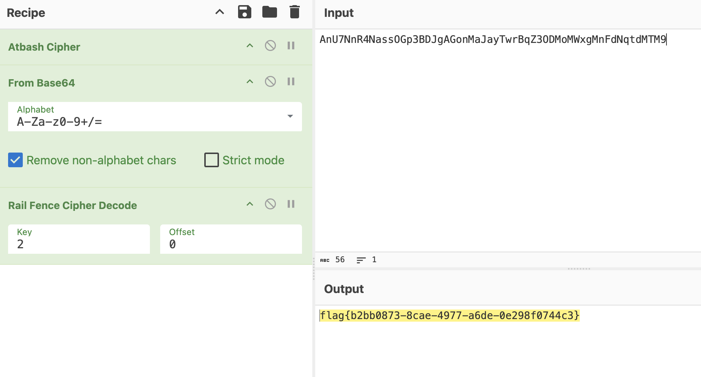

### **CTF密码学练习**

陈张萌
2024/7/3

<!-- ---

### 安全密码

- 不依赖算法保密性，依赖密钥保密性
- 计算安全:在可接受的时间、空间成本内被破解概率很小的密码 
- 对称加密:加解密使用相同的密钥，一般长度至少128bit
- 非对称加密:分为公钥和私钥，加解密使用不同的密钥
- 非对称加密一般依赖于数学难题
 -->

---

### 推荐安装

pip3 install pycryptodome
factordb.com


---

### 古典密码

AtBash密码+base64解密（经常跟密码学混在一起）+栅栏密码

<style scoped>
section img {
    position: absolute;
    top: 34%;
    left: 13%;
    width: 75%;
}
</style>




---

### rsa-factor

直接丢到factordb里面就可以解出来

---

### rsa-m3

$$
c1 = pow(m, e, n) $$
$$
c2 = pow(m+1, e, n)
$$

又因为$e=3$

因此有

$$
c1=m^3\mod n$$
$$
c2=(m^3+3m^2+3m+1)\mod n
$$

---

### rsa-m3

因此有

$$
c2-c1-1=3(m^2+m)\mod n $$
$$
c2+c1=(2m+1)(m^2+m+1)\mod n 
$$

因此可以得到$2m+1$的值，进而求出$m$


---

### rsa-fragile

可以发现p,ra,a,q,rb,b之间存在一定的关系：

$$
p=a^8+ra
$$
$$
q=b^8+rb
$$

ra_的作用是使得p不一定是大于$a^8$的第一个质数。
然后我们会发现：
$$
n=p*q=(a^8+ra)*(b^8+rb)
$$

---

### rsa-fragile

再根据：

```
        if ra > 100000 or rb > 100000:
            continue
        if b > iroot(2 * pow(a, m) + ra, m)[0]:
            continue
        if ra > 2 * iroot(a,m//2)[0] or rb > 2 * iroot(b,m//2)[0]:
            continue
        break
```

这些约束关系，我们可以发现ra和rb都很小。这样的话，对n开8次跟号，取整数部分，发现这就是ab。因为$(a+1)^8b^8$和$a^8(b+1)^8$都小于n。


---

### rsa-fragile

发现n开8次跟号后很小，已经可以直接进行质因数分解了。分解结果：

```
nbs=[2,2,2,7,17,17,23,144680046702678787996517557250872603,2112824752321302638932489226261448911]
```

然后观察题目中的约束条件，发现a和b都是128位，p和q都是1024位，而且a<b<2a。因此，对上面的质因数进行排列组合后，计算出符合约束条件的a和b

得到满足条件的a和b，进而就可以直接计算得到p,q，进而得到n的分解。然后就可以求出phi和d，由密文算出明文。

---

### rsa-easy

$$n1 = p1 * q1$$
$$
n2 = p2 * q2 $$ 
$$
n = p1 * q2 * r$$

那么

$$
q2=gcd(n2,n) $$
$$
p1=gcd(n1,n)
$$

而且题目里面已知r是500以内的素数，因此将500以内的素数遍历一下即可得到r，进而得到n的质因数分解


---

<!-- _class: lead -->

<!-- _paginate: false -->

<!-- _backgroundImage: url('./figures/hero-background.svg') -->

# Thanks!

