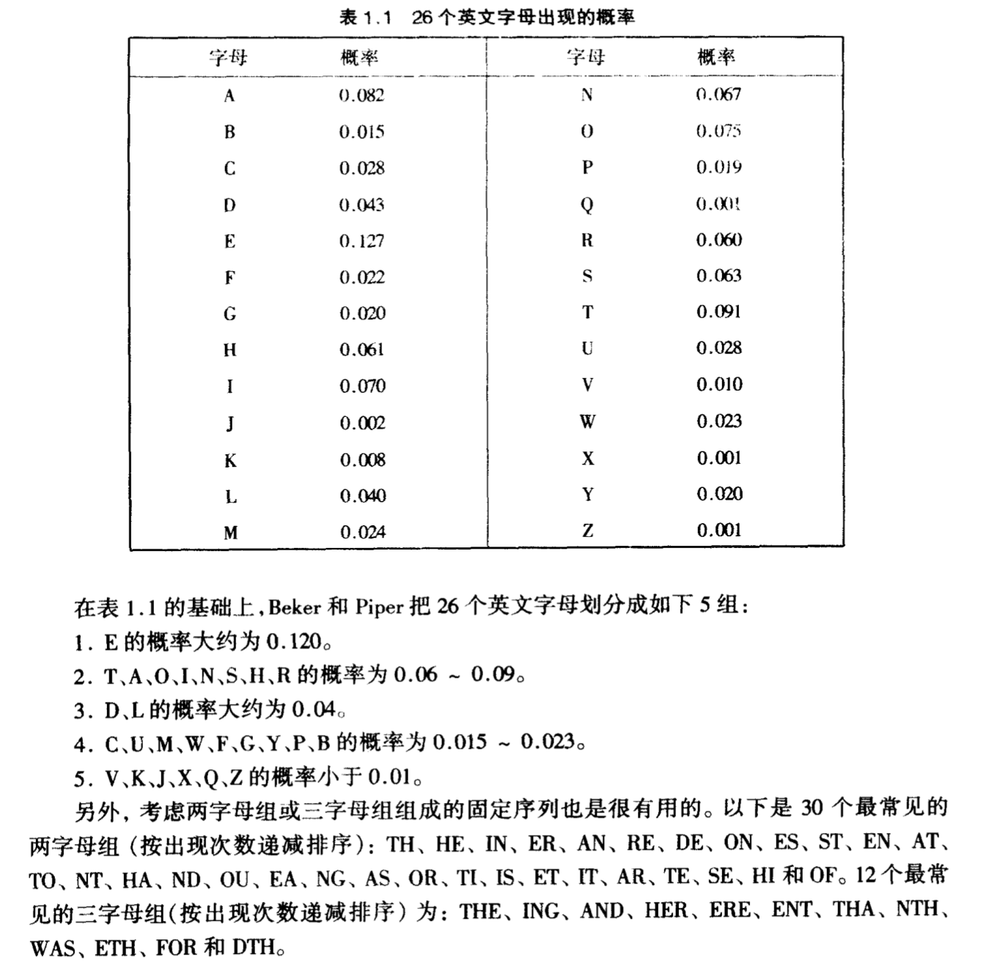
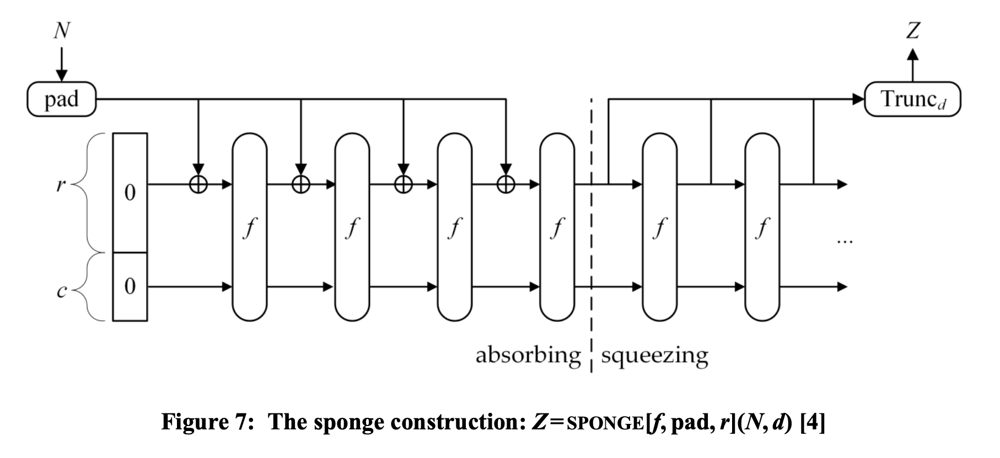
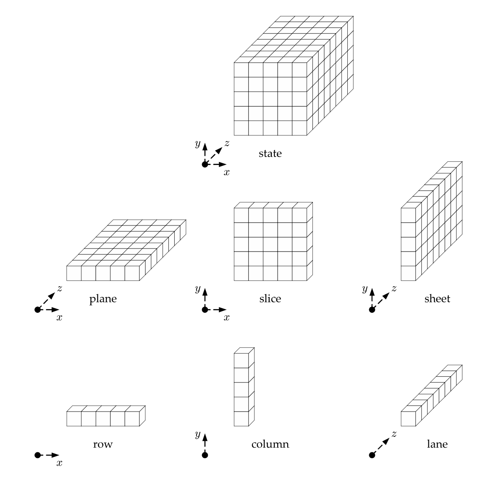
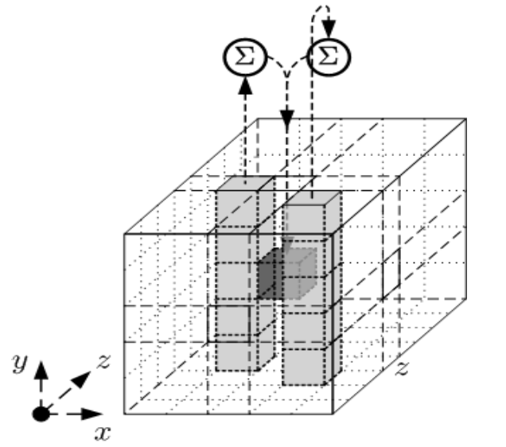
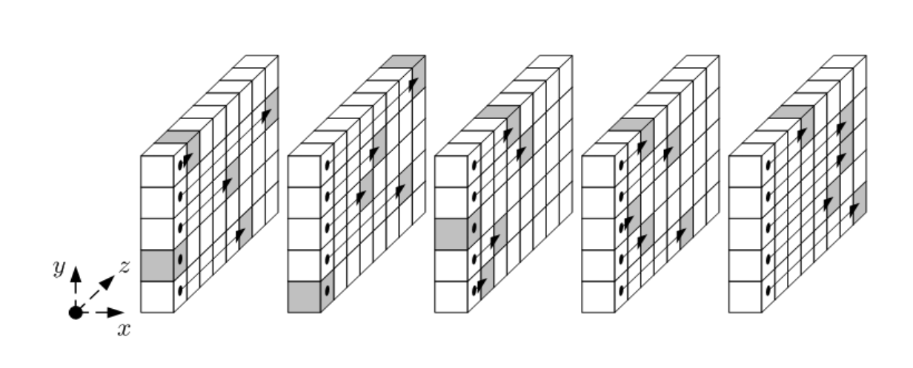
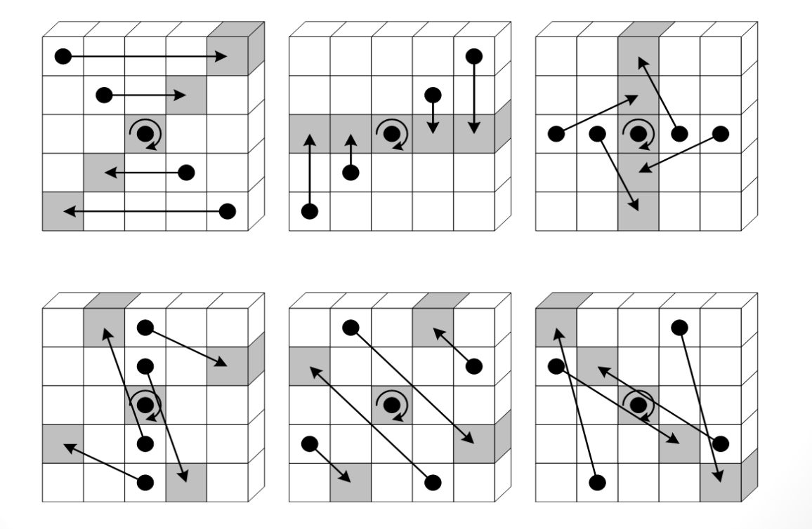

### **CTF密码学基础**

陈张萌
2024/7/3

<!-- ---

### 安全密码

- 不依赖算法保密性，依赖密钥保密性
- 计算安全:在可接受的时间、空间成本内被破解概率很小的密码 
- 对称加密:加解密使用相同的密钥，一般长度至少128bit
- 非对称加密:分为公钥和私钥，加解密使用不同的密钥
- 非对称加密一般依赖于数学难题
 -->

---

### 推荐安装

pip3 install pycryptodome
factordb.com


---

### 目录

- 古典密码
- 哈希
- RSA


---

### 威胁模型

- 唯密文攻击：敌手只拥有密文y
- 已知明文攻击：敌手拥有明文串x及其对应的密文y
- 选择明文攻击：敌手可获得对加密机的临时访问权限，这样他能够选择一个明文串x，并可获得相应的密文串y
- 选择密文攻击：敌手可获得对解密机的临时访问权限，这样他能够选择一个密文串y，并可获得相应的明文串x

<!-- 不同的威胁模型假设 -->


---

### 欧几里得算法

<style scoped>
section li {
    font-size: 29px;
}
</style>

- a|b:b%a=0，a是b的因子
- gcd(a,b):最大的满足c|a且c|b的正整数c，最大公约数
- gcd(a,b)=gcd(a-b,b)=gcd(a%b,b)，辗转相除法(欧几里得算法)
- 互质:gcd(a,b)=1

```c++
int gcd(int a, int b){
    if (b == 0)
        return a;
    else
        return gcd(b, a%b);
}

```

---

### 扩展欧几里得算法

<style scoped>
section li {
    font-size: 29px;
}
</style>

- 裴蜀定理:ax+by=c有整数解(x,y)的充要条件是gcd(a,b)|c
- 扩展欧几里得算法：ax+by=gcd(a,b)，求x，y和gcd(a,b)

```c++
int exgcd(int a, int b, int &x, int &y){
    if (b == 0){
        x = 1;y = 0;
        return a;
    }
    int d = exgcd(b, a % b, y, x); //这里交换了x和y
    y -= (a / b) * x;
    return d;
}
```

---

### Zn上的逆元
<!-- <style scoped>
section li {
    font-size: px;
}
</style> -->

- 已知a,n>0，存在x，满足 $a*x\ mod \ n=1$
- 若gcd(a,n)=1，考虑方程ax+nk=1，由裴蜀定理得存在整数解(x,k)
<!-- - 由扩展欧几里得算法可知，通解是xk=x+kn，则 -->
- 存在唯一$0<=x<n$，满足$a*x\ mod \ n=1$
- 记$x=a^{-1}\ mod\ n$，称x是a的逆元
<!-- - 定义除法：$\frac{a}{b}\ mod\ n=a*b^{-1}\ mod\ n$ -->
<!-- 另外还有一个phi（n） -->


---

### 古典密码

基本上都是唯密文攻击。

单表代换：明密文一一对应

在密文长度足够长（而且是有意义的一段文字）时：
通用解法：词频分析 http://quipqiup.com/

常见的随机替换，基本上就只能这样求解（各种各样的图形密码也算随机替换）

但是密文较短时不适用。


<!-- 我们首先看下单表代换。单表代换密码的特点呢，是明文和密文一一对应的。密文足够长的时候，不管用的什么方式，都可以使用通用解法就是词频分析。这里有现成的在线工具可以用。

不过如果密文长度较短，那么词频分析就不好用了。这种时候怎么办呢 

随机替换这种就只能用词频分析
-->

---

### 古典密码

<style scoped>
section img {
    position: absolute;
    top: 0%;
    left: 30%;
    width: 60%;
}
</style>




---


### 古典密码

<style scoped>
section li {
    font-size: 30px;
}
</style>

##### 单表代换

古典密码，尤其是单表代换，代换规则就几种常用的，直接对于各种代换规则挨个尝试即可。

常用工具：https://gchq.github.io/CyberChef/

+ 移位密码：将明文中的 每个字母都按照其在字母表中的顺序向后（或向前）移动固定数目（循环移动）作为密文
$$
e_k(x)=x+k\mod 26
$$
+ 移动3位：凯撒密码


---


<style scoped>
section li {
    font-size: 27px;
}
</style>


### 单表代换

特殊的移位密码（ASCII码的移位）

+ ROT系列：https://www.qqxiuzi.cn/bianma/ROT5-13-18-47.php

    + ROT5：只对数字进行编码，用当前数字往前数的第5个数字替换当前数字，例如当前为0，编码后变成5，以此类推顺序循环。
    + ROT13：只对字母进行编码，用当前字母往前数的第13个字母替换当前字母，例如当前为A，编码后变成N，以此类推顺序循环。
    + ROT18：将ROT5和ROT13组合在一起
    + ROT47：对数字、字母、常用符号进行编码，按照它们的ASCII值进行位置替换，用当前字符ASCII值往前数的第47位对应字符替换当前字符，例如当前为数字0，编码后变成符号_。用于ROT47编码的字符其ASCII值范围是33－126，具体可参考ASCII编码。

---

<style scoped>
section li {
    font-size: 27px;
}
</style>


### 单表代换


+ AtBash密码：

ABCDEFGHIJKLMNOPQRSTUVWXYZ
ZYXWVUTSRQPONMLKJIHGFEDCBA

---
### 单表代换

+ 仿射密码：

加密：
$$
e(x)=ax+b\mod 26
$$

$e(x)$是单射当且仅当$gcd(a,26)==1$

解密：
$$
d(y)=a^{-1}(y-b)\mod 26
$$

---

### 古典密码

<style scoped>
section li {
    font-size: 29px;
}
</style>

##### 多表代换

频率分析不适用。常见的多表代换：

+ Playfair：http://www.metools.info/code/playfair_186.html

+ Vigenère cipher：https://planetcalc.com/2468/
或：https://www.mygeocachingprofile.com/codebreaker.vigenerecipher.aspx

+ Hill：http://www.practicalcryptography.com/ciphers/hill-cipher/

---

### 多表代换

##### Playfair

一个基于5×5的字母矩阵，从左到右、从上到下填写。先填入密钥的字母（重复的字母不填），然后再以字母表顺序依次填入其他字母。字母 I 和 J 算作一个字母。

加密：将明文按两个字母一组进行分组，然后在矩阵中找对应的密文。

+ 同行、同列的明文则向右、向下位移一位得到的字母作为密文输出
+ 不同行不同列的明文则取其同行同列交互的字母作为密文输出

无法用频率分析破解，需要密钥

---

### 多表代换

##### Vigenère

$$
K=(k_1,k_2,...,k_m)$$
$$
e_k(x_1,x_2,...,x_m)=(x_1+k_1,x_2+k_2,...,x_m+k_m)
$$

举个例子，密钥K=CIPHER，明文为HELLOWORLD，则加密为JMASSNQZAK。

唯密文攻击可以做，不过需要较长的密文。 Kasiski测试法/重合指数法。

---

### 多表代换

##### Hill


$$
e_K(x)=xK，其中K是定义在\mathbb{Z}_{26}上的 m × m 可逆矩阵
$$

$$
d_K(y)=yK_{-1}
$$

唯密文攻击困难，已知明文攻击可以攻破。

---

### 古典密码

##### 置换密码

保持明文的所有字母不变，只是利用置换打乱了明文字母的位置和次序。

+ 栅栏密码

把要加密的明文分成N个一组，然后把每组的第1个字连起来，形成一段无规律的话。


---

### 古典密码小结

+ 单表代换：万能解法频率分析
+ 多表代换：频率分析不适用QAQ密文较长时有一些算法可以尝试接出，密文较短时破解困难，需要密钥
+ 置换密码：密码本身较为简单，可以和其他两个密码结合

词频分析+遍历各种算法尝试
除了前面介绍的还可能有各种各样的密码

在比赛里可能会出现（题比较多，难度有从简单到难明显分级的比赛基本上都会有）算送分的签到题。~~当然实在实在做不出来就算了，不要影响自己心情，反正大多数队伍都能做出来，会让这道题分数很低~~


---

### 哈希

对于任意长度的消息m，生成固定长度的哈希值H(m)
密文空间比明文空间要小，单向加密（已知明文算密文容易，已知密文算明文困难）
常用：SHA-256，SM3等

---

### 哈希函数常用构造方法：海绵结构

计算过程中使用的数据结构：

+ 一个由b个bit构成的state。将其分为2个部分，并且起不同的名字： 
    + outer part： 这个state的前r个比特
    + inner part： 该state的后c个比特，其中c = b − r

<!-- 为啥叫这个名字呢？这也是有讲究的qwq一会儿讲了具体算法就知道了 -->

数据初始化：

+ 消息填充为r的整数倍，并且切分为多个r-bit的数据块
+ 用于计算的b比特的state初始化为0

<!-- 

海绵结构每轮运算处理的数据，是一个由b个比特构成的state，它分为两部分：一部分是outer part，是这个state的前r个比特。一部分是inner part，是这个state的后 b-r 个比特。 

在收到一条消息之后，首先需要将它进行padding，然后切分为若干个rbit的数据块。inner part通常被初始化为0。
-->

---
### 哈希函数常用构造方法：海绵结构

消息处理两个阶段：

+ **absorbing phase**，当前state的前r个比特位，和分块后的message依次进行异或。每进行一次异或，就对整个b bit的state进行一个**特定的permutation过程**。
+ **squeezing phase**，在每次迭代中，海绵结构会产生n个输出比特，其中在每次迭代中，状态的前r位被返回作为输出。

---
### 哈希函数常用构造方法：海绵结构

<style scoped>
section img {
    position: absolute;
    top: 20%;
    left: 10%;
    width: 80%;
}
</style>



---
### Keccak计算流程（SHA3）

1. 消息填充

海绵结构的整体设计是，当收到一条消息时，首先是将消息进行填充和切分。

Keccak采用的padding方式是先填充一个为1的bit，然后填充若干个0比特，最后再填充一个1比特，使得填充后总长度为尽可能小的r的倍数。

---

### Keccak介绍

2. 数据结构（state的规模）

b = 1600
c = 2n, where n ∈ {224, 256, 384, 512}. (inner part)
r = b - c (outer part)

每一个state包括1600个bit，可以看作规模5*5*64的三维向量a[5][5][64]。 其中每一个bit都对应一个坐标，可以用 a[x][y][z] 表示。 

---

### Keccak介绍
2. 数据结构

<style scoped>
section img {
    position: absolute;
    top: 0%;
    left: 40%;
    width: 60%;
}
</style>



<div style="width:50%">

<!-- <style scoped>
section li {
    font-size: 29px;
}
</style> -->

+ row:  a[∗][y][z]
+ column:  a[x][∗][Z]
+ lane: a[x][y][∗]
+ slice: a[∗][∗][z]
+ plane: a[∗][y][∗]
+ sheet: a[x][∗][∗]

</div>


<!-- 
参考一下sha3文档里面的介绍，我们会用到的就是row，column，lane和slice的概念。看图就可以有一个比较直观的感受
 -->

---

### Keccak介绍

3. absorbing phase

当前state的前r个比特位，和分块后的message依次进行异或。每进行一次异或，就对整个b bit的state进行一个**特定的permutation过程**。


---

### Keccak介绍

4. The Keccak permutation

共24轮permutation。 
R = ι ◦ χ ◦ π ◦ ρ ◦ **θ**. 

<!-- Keccak的permutation一共24轮，每一轮permutation都是5个映射：theta，rho，pi，ksi，iota的复合。 -->


<div style="width:40%">

+ θ：线性映射, which adds to each bit in a column, the parity of two other columns.

</div>

<style scoped>
section img {
    position: absolute;
    top: 10%;
    left: 45%;
    width: 50%;
}
</style>





<!-- theta是一个线性映射，对于某个点xyz，它会把[x-1][*][z]对应的那一列，以及[x+1][*][z-1]对应的一列上的数据之和加到这一个点的值上。
 -->

---

### Keccak介绍

4. The Keccak permutation

共24轮。 R = ι ◦ χ ◦ π ◦ **ρ** ◦ θ. 

<div style="width:40%">

+  ρ 线性映射，rotates the bits within each lane by T(x,y), which is a predefined constant for each lane.

ρ: a[x][y][z] ← a[x][y][z + T (x, y)]

</div>

<style scoped>
section img {
    position: absolute;
    top: 30%;
    left: 40%;
    width: 60%;
}
</style>



<!-- 作用完theta之后会作用rho。rho的作用是对于每一个lane（和z轴平行的一列格子），根据x和y的坐标进行一定的位置上的轮转变换。
-->

---

### Keccak介绍

4. The Keccak permutation

共24轮。 R = ι ◦ χ ◦ **π** ◦ ρ ◦ θ. 

<!-- 然后作用pi函数。pi函数就是对lane的位置进行变换，交换几条不同的lane。
-->

<div style="width:40%">

+ π reorders the lanes.

</div>

<style scoped>
section img {
    position: absolute;
    top: 27%;
    left: 40%;
    width: 60%;
}
</style>




---

### Keccak介绍

4. The Keccak permutation

共24轮。 R = ι ◦ **χ** ◦ π ◦ ρ ◦ θ. 

χ: a[x][y][z] ← a[x][y][z] + ((¬a[x + 1][y][z]) ∧ a[x + 2][y][z])

注意：此映射不可逆。这是整个Keccak计算过程中唯一一个不可逆的步骤


---

### Keccak介绍

4. The Keccak permutation

共24轮。 R = **ι** ◦ χ ◦ π ◦ ρ ◦ θ. 

ι 给state的某些位置异或一个常数

---

### Keccak介绍

5. squeezing phase，在每次迭代中，海绵结构会产生n个输出比特，其中在每次迭代中，状态的前r位被返回作为输出。


---

### 哈希函数的通用攻击方法


暴力攻击（ https://hashcat.net/hashcat/ ）

哈希长度拓展攻击（ https://github.com/bwall/HashPump ）

生日攻击（https://github.com/SethosII/birthday-attack）

通用攻击方法基本上都有在线的轮子可以用。

~~但是基本上一般的哈希函数不用指望能攻击出来，不然请直接发论文~~


---
### 哈希函数哪些攻击做不了

对于目前来看安全的哈希(如SHA-256，SM3)，无法实现的攻击：

- 生成满足特定条件的哈希值
- 生成一个跟特定m哈希值相同的m’(除了m本身) 
- 生成两个哈希值相同的m，m’(除非m=m’)

对于这些就基本上不用考虑直接攻击了，因为已经从数学上证明了计算不可行

~~同理要是真的有攻击方法也轮不到ctf题，请直接发论文~~

---

### 可以攻击的：MD5

<style scoped>
section li {
    font-size: 28px;
}
</style>

- MD5碰撞攻击：可以找到两个哈希值相同的不同密文m，m’。[2005年，王小云、于红波， How to break MD5 and Other Hash Funcitons, Eurocrypt 2005.]

- http://www.cmd5.com/ 、http://www.ttmd5.com/ 、http://pmd5.com/ （已知密文查询明文）

- https://www.win.tue.nl/hashclash/fastcoll_v1.0.0.5.exe.zip （对于相同的前缀，生成两个不同的消息，MD5值相同）
- https://github.com/cr-marcstevens/hashclash
    - 对于几乎相同的前缀(只在1个特定位置不同)，生成两个不同的消息，MD5值相同(比较快)
    - 对于几乎相同的前缀(在几个特定位置不同)，生成两个不同的消息，MD5值相同(比较慢)
    -  对于不同的前缀，生成两个不同的消息，MD5值相同(非常慢)


---

### 另一个可以攻击的：SHA1

+ 谷歌发布的SHA1碰撞，找到两个摘要相同但内容不同的PDF：https://shattered.io/

+ 在线工具：Quick-and-dirty PDF maker using the collision from the SHAttered paper：https://alf.nu/SHA1

<!-- 现在SHA1也并不安全了，在17年的时候谷歌发布了SHA1碰撞的文章，造出了两个摘要相同但是内容不同的PDF。

同样也有人基于这个成果造了个在线工具，是生成jpg图片的。大家感兴趣的话可以上去试一试。
-->

---

### ctf中的哈希函数相关题目

哈希函数的特点就是能做的和不能做的范围都很清楚

出现在ctf题目里的时候经常跟其他类型的题目结合起来出

（例如misc或者web）

---

### 非对称加密

安全密码
+ 不依赖于算法的保密性 ， 依赖于密钥的保密性
+ 计算安全：通俗点说就是在可接受的时间，空间，成本内被破解概率很小的密码
+ 对称加密：加解密使用相同的密钥，一般长度至少128bit
+ 非对称加密：分为公钥和私钥，加解密使用不同的密钥
+ 非对称加密一般依赖于数学难题


---

### 非对称加密

常用：RSA

目前为止都是难以暴力破解的，只有短的 RSA 密钥才可能被强力方式解破。

对于某些特殊情况可以攻击


---

### RSA加解密流程

- $\phi(n)$:正整数n，$1<=i<=n$中与n互质的i的个数
- 随机生成两个很大的质数p和q，n=pq，$\phi(n)=(p-1)(q-1)$（然后把p和q扔掉）
- 生成e，满足$gcd(e,\phi(n))=1$
- 计算$d=(e^{-1})\ mod\ \phi(n)$
- 公钥为(n,e)，私钥为(n,d)

---

### RSA加解密流程

- 假设明文m为：满足1<=m<n 且 gcd(m,n)=1 的整数
- 加密：密文$c=m^e\ mod\ n$
- 解密：明文$m=c^d\ mod\ n$

---

### RSA的安全性

- RSA攻击就是：已知n,e,c，且$c=m^e\ mod\ n$。求m
- 本质上是**离散对数问题**
- 已知m,e求c：容易
- 已知e,c求m：很难
- 已知m,c求e：很难


---
### RSA的安全性

- 换一个角度
- 解密过程是：$m=c^d\ mod\ n$
- 只要知道私钥d就可以算出m
- 如果知道$\phi(n)$，就可以算出私钥d
- 如果知道p和q，就可以算出$\phi(n)$
- $n=p*q$是已知的，本质上是**大整数的质因数分解问题**

---

### RSA的安全性

- 对于很大的n，质因数分解非常困难。复杂度是多少？


**常用的大整数分解算法：二次筛法，椭圆曲线算法，数域筛法**

<style scoped>
section table {
    font-size: 28px;
    width: 100%;
    margin: 0 auto;
    margin-top: 10px
}
</style>

| 算法名称      | 时间复杂度   | 
| ---------------- | ---- | 
| 二次筛法     |  $O(e^{(1+o(1))*\sqrt{ln(n)*lnln(n)}})$ |
| 椭圆曲线算法     |  $O(e^{(1+o(1))*\sqrt{2ln(p)*lnln(p)}})$ |
| 数域筛法     |  $O(e^{(1.92+o(1))*ln(n)^{\frac{1}{3}}*lnln(n)^{\frac{2}{3}}})$ | 

~~其实这些算法我也不是特别会，但是总之是计算安全的~~

---

### RSA的安全性

- 对于$n=p* q$，n已知且p、q未知，算$\phi(n)=(p-1)*(q-1)$和分解n的难度是相同的
- 这意味着已知e求d的难度和分解n是相同的
- 在实际应用场景中，一般p和q至少为512位，n至少为1024位

知道$\phi(n)$和n可以快速分解n
- 如何分解？


---

### RSA的安全性

- 对于n=p\*q，n已知且p、q未知，算$\phi(n)=(p-1)*(q-1)$和分解n的难度是相同的
- 这意味着已知e求d的难度和分解n是相同的
- 在实际应用场景中，一般p和q至少为512位，n至少为1024位

知道$\phi(n)$可以快速分解n

- 如何分解？
- $n=pq, \phi(n)=(p-1)*(q-1)$
- $p^2-(n-\phi(n)+1)p+pq=0$
- 一元二次方程求根公式

--- 
### RSA的安全性

- 刚刚已经知道了大整数分解非常困难
- 也就是说标准 RSA 算法在不泄漏任何私钥信息的情况下迄今不存在多项式时间的破解算法
- **对于一些特殊的RSA算法可以进行攻击**

---

### RSA攻击方法：直接分解n

- 一般n不超过256bit才能考虑直接分解n

暴力分解常用工具：
- factordb.com
- Sage
- YAFU
- CADO-NFS

（实际应用总会使用的RSA，n都在1024及以上，不用考虑暴力分解的问题）

---

### p-1光滑时：Pollar p-1

<style scoped>
section li {
    font-size: 27px;
}
</style>

- 光滑数 (Smooth number)：指可以分解为小素数乘积的正整数
- 当p是N的因数，并且p-1是光滑数，可以考虑使用Pollard's p-1算法来分解N [Pollard, John M.. “Theorems on factorization and primality testing.” Mathematical Proceedings of the Cambridge Philosophical Society 76 (1974): 521 - 528.]
<!-- （且算法流程很简单） -->

<!-- ---

### p-1光滑时：Pollar p-1 -->

- 算法流程：
```python
def algorithm(n,B): # n是模数，B是“界”
    a=2
    for j in range(2,B+1):
        a=pow(a,j,n)
    d=GCD(a-1,n)
    if d>1 and d<n:
        return d
    return -1
```

---

### p-1光滑时：Pollar p-1

<style scoped>
section li {
    font-size: 27px;
}
</style>

- 算法证明：
    + 算法假定$p|n$且$p$是素数，且假定对每一个满足$q|(p-1)$且$q$是素数的$q$，都有$q\leq B$。因此一定有：$(p-1)|B!$。
    + for循环结束时有：$a \equiv 2^{B!}\ mod\ n$
    + 因为 $p|n$，因此有：$a \equiv 2^{B!}\ mod\ p$
    + 费马小定理：$2^{p-1}\equiv 1\ mod\ p$
    + 而$(p-1) | B!$，因此$2^{B!}\equiv 1\ mod\ p$，$a\equiv 1\ mod\ p$，因此$p|(a-1)$
    + 因此$d=gcd(a-1,n)$，找到了n的非平凡因子d

- 在线工具：https://mathworld.wolfram.com/Pollardp-1FactorizationMethod.html

- 在实际中：选择两个大素数$p_1,q_1$使得$p=2p_1+1,q=2q_1+1$也是素数，此时$n=pq$可以抵抗此方法


<!-- - 算法流程： -->

<!-- 
---

### 大整数分解算法：Pollar ro -->

--- 

### 其他模数选取不当的情况

- p+1光滑：William p+1 算法[Williams, Hugh C.. “A $p+1$ method of factoring.” Mathematics of Computation 39 (1982): 225-234.] https://mathworld.wolfram.com/WilliamspPlus1FactorizationMethod.html
- p-q很小;$\frac{(p+q)^2}{4}-n=\frac{(p+q)^2}{4}-pq=\frac{(p-q)^2}{4}$，因为$|p-q|$很小，所以$\frac{(p-q)^2}{4}$很小，因此$\frac{(p+q)^2}{4}$和$\sqrt{n}$接近。因此可以遍历$\sqrt{n}$附近的整数x，寻找使得$x^2-n=y^2$成立的整数y，然后用平方差公式分解。轮子：https://wiki.mrskye.cn/Crypto/yafu%E5%AE%89%E8%A3%85%E5%8F%8A%E4%BD%BF%E7%94%A8/
<!-- - p,q满足$gcd(p-1,q-1)=2g$，其中$g$是个大素数; -->
<!-- - p,q最低一部分连续比特位相同; -->


---
### RSA攻击：共模攻击

- 同一个m，同一个N，用不同的e1和e2加密，且gcd(e1,e2)=1 

明文消息为m，密文分别为：

$$
\begin{aligned}
c1=m^{e1}mod N \\
c2=m^{e2}mod N
\end{aligned}
$$

假设攻击者获得了N，c1，c2。如何获得明文m？

<!-- 除了直接分解N之外，也有不分解N就能获得明文的方法。 -->

---
### RSA攻击：共模攻击

- 裴蜀定理：ax+by=c有整数解(x,y)的充要条件是gcd(a,b)|c
- 已知gcd(e1,e2)=1，使用扩展欧几里得算法，解e1x+e2y=1得到x和y
- $m=c1^x * c2^y\ mod\ N$

因为：
$$
\begin{aligned}
c1^xc2^y &\equiv m^{xe1}m^{ye2} mod N \\
&\equiv m^{xe1+ye2}\ mod\ N \\
&\equiv m\ mod\ N
\end{aligned}
$$

<!-- 回顾一下裴蜀定理 -->


--- 

### RSA攻击：n1和n2不互素

- 已知多个公钥和对应的密文
- 发现其中存在(N1,e1),(N2,e2)，$gcd(N1,N2)\neq 1$

可直接求得$p1=gcd(N1,N2), q1=\frac{N1}{gcd(N1,N2)}$，完成质因数分解


--- 

### RSA攻击：Coppersmith的方法

在以下两种情况下可以对小公钥指数加密进行攻击：

+ 一类是加密指数较小，同时已知明文的部分比特
+ 另一类是使用小加密指数进行重复加密。

Coppersmith的方法可以求方程f(x1,x2,…)%n=0的一个较小的根

轮子：https://github.com/kionactf/coppersmith

论文：[Coppersmith D. Small solutions to polynomial equations, and low exponent RSA vulnerabilities[J].Journal of Cryptology, 1997,10(4):233-260.] ~~很遗憾这个我也看不懂~~


---

### RSA攻击：广播攻击

一个用户使用同一个加密指数 e 加密了同一个密文，并发送给了其他 e 个用户。

以e=3为例说明攻击方法。假设加密者使用了三个不同的模数 n1,n2,n3，给三个不同的用户发送了加密后的消息 m。因此有：
$$
\begin{aligned}
c1=m^3\ mod\ n1 \\
c2=m^3\ mod\ n2 \\
c3=m^3\ mod\ n3
\end{aligned}
$$
这里我们假设n1,n2,n3互素(否则可以直接利用这一点进行质因数分解)
同时，假设 $m<n_i,1≤i≤3$。（否则情况较为复杂，暂不讨论）

---
### RSA常用攻击方式：广播攻击

中国剩余定理：$n_1,n_2,...,n_r$都是整数，且对于 $i\neq j$ 有 $gcd(n_i,n_j)\neq1$。那么：
$$
\begin{aligned}
x &\equiv c_1 mod n_1 \\
x &\equiv c_2 mod n_2 \\
&...\\
x &\equiv c_r mod n_r \\
\end{aligned}
$$
有唯一解。记$N=n_1n_2...n_r$ 则
$x\equiv c_1N_1d_1 + c_2N_2d_2 + ... + c_rN_rd_r mod N$，其中
$N_i=\frac{N}{n_i}, d_i \equiv N^{-1} mod\ n_i$

<!-- 中国剩余定理，有r个整数，并且两两互质。 -->
<!-- 这样一个同余方程组有唯一解 -->
<!-- 唯一解由下面这个公式给出 -->

---

### RSA常用攻击方式：广播攻击
回到e=3的广播攻击情况，根据中国剩余定理，可得

$m^3 \equiv c_1N_1d_1 + c_2N_2d_2 + c_3N_3d_3\ mod\ n1*n2*n3$

因为假设了$m<n_i,1≤i≤3$，因此可以计算$c_1N_1d_1 + c_2N_2d_2 + c_3N_3d_3\ mod\ n1*n2*n3$的值并直接开三次根号求得m。

<!-- 对比一下中国剩余定理，发现m的3次方就可以解出来了。 -->
<!-- 解出来之后，又因为这个假设，就可以直接开根号，得到明文m -->

---

### RSA常用攻击方式：维纳攻击

低解密指数也可以加速解密，但是也可能被攻击

+ d很小($d<n^{\frac{1}{4}}$)，$q<p<2q$时，可在多项式时间内分解n
+ 轮子：https://github.com/pablocelayes/rsa-wiener-attack


论文：[Cryptanalysis of RSA with Small Prime Difference,Benne de Weger,2000] ~~看不懂+1~~

<!-- 当解密指数d比较小的时候也是可以进行攻击的 -->
<!-- 这个比较复杂，不需要掌握细节。只需要知道可以这样攻击就好 -->


<!-- 

这个领域的论文也很有意思，就是那种偏数学的。零几年的论文也已经算是前沿论文了（

对于再近一些的论文就是：对于某种极为特殊的情况，有一定的概率可以分解出来，这种也没必要
 -->

<!-- ---

### 练习

https://cloud.tsinghua.edu.cn/d/02e42e3c85b941e8b2eb/
 -->

---

### RSA小结

RSA真的很常见，体感就是每次比赛（除非那种每道题都很难的高端比赛）

<!-- ---

### 椭圆曲线

https://xie.infoq.cn/article/078ba2e8b3fc0da2d1ec917c3

todo：做成PPT


椭圆曲线ctf例题
https://forum.butian.net/share/1601 -->


<!-- ---

### 参考文献
<style scoped>
section li {
    font-size: 23px;
}
</style>

+ Bertoni, G., Daemen, J., Peeters, M., Van Assche, G.: The Keccak SHA-3 submis- sion. Submission to NIST (Round 3) (2011)


+ Dinur, I., Dunkelman, O., Shamir, A. (2012). New Attacks on Keccak-224 and Keccak-256. In: Canteaut, A. (eds) Fast Software Encryption. FSE 2012. Lecture Notes in Computer Science, vol 7549. Springer, Berlin, Heidelberg. https://doi.org/10.1007/978-3-642-34047-5_25


+ 王小云、于红波， How to break MD5 and Other Hash Funcitons, Eurocrypt 2005.

+ Pollard, John M.. “Theorems on factorization and primality testing.” Mathematical Proceedings of the Cambridge Philosophical Society 76 (1974): 521 - 528.

+ Williams, Hugh C.. “A $p+1$ method of factoring.” Mathematics of Computation 39 (1982): 225-234.

+ Coppersmith D. Small solutions to polynomial equations, and low exponent RSA vulnerabilities[J].Journal of Cryptology, 1997,10(4):233-260.

+ Cryptanalysis of RSA with Small Prime Difference,Benne de Weger,2000

+ 石梦. LLL算法在RSA安全性分析中的应用[D].解放军信息工程大学,2013. -->
---

<!-- _class: lead -->

<!-- _paginate: false -->

<!-- _backgroundImage: url('./figures/hero-background.svg') -->

# Thanks!

