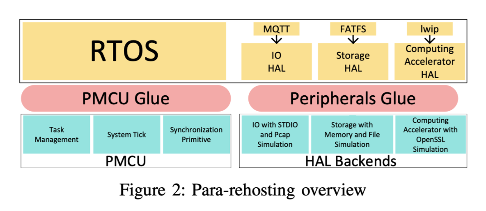

### **论文分享: From Library Portability to Para-rehosting: Natively Executing Microcontroller Software on Commodity Hardware**

##### 

---

## 目录

- 固件fuzzing的几种常用解决方案
- rehosting的优势和困难
- para-rehosting设计目标
- para-rehosting具体设计
- 实验和评估
- 和其他工作进行对比
- 总结

---

### 固件fuzzing的几种常用解决方案

1) On-device Analysis：这种方法需要真实设备来进行测试。它得到了最真实可信的结果，但可扩展性较差，且缺乏可见性。因为在裸机上收集执行信息较为困难。
2) Full Emulation：为了克服真实硬件上的性能和可扩展性问题，研究人员提出了使用如QEMU这样的完整仿真器来模拟固件执行。主要面临的挑战是对外设的方针难以模拟。
3) Peripheral Forwarding：将外设访问转发到真实设备，并将固件在仿真器内运行。由于依赖真实硬件，性能和可扩展性问题仍未解决。
4) Semi-rehosting：固件的主要逻辑仍然在仿真器内执行，外设相关的处理被识别出来，在主机上运行。

---

### rehosting的优势

rehosting：将MCU(microcontroller)软件重新编译，使其在x86用户态作为一个软件执行。有很多好处：

1. 现有的很多成熟的x86动态分析工具可以使用
2. 与在真实的MCU设备上运行相比，可以同时启动多个实例，支持进行可扩展和并行的分析
3. 通用OS的硬件设备比MCU设备强大得多，可以在更短的时间内执行更多的测试用例

通过人工的操作，可以完成将MCU固件移植到特定的架构的机器的工作。

---

### rehosting的困难

但是这个过程是非常困难的。例如：

1. MCU工具链中使用的C标准库（如newlib和redlib）与GNU libc等完整的C库实现在设计上存在差异。
2. 单个库有时与一组支持的操作系统例程混合在一起，这些例程也需要被移植。这些例程可能包括实时操作系统（RTOS）的任务切换、中断处理、定时器管理等。
3. 这些例程受到调度的影响，如果不考虑到调用序列，预期的逻辑很容易被破坏。
4. 如果rehosting的代码需要访问MCU上的真实硬件，那么在主机上的行为将变得不可预测。

---

## para-rehosting 设计目标

通过pararehosting，我们可以将整个RTOS逻辑，包括内核、task等一起编译成一个单一的主机程序。它们共享主机上一个进程的虚拟地址空间。

1. 抽象了大多数MCU操作系统遵循的整个机器模型，并使用可移植操作系统接口（POSIX）实现了它（命名为PMCU）。
2. PMCU可以与上层源代码（包括库和task）一起编译成主机上的普通用户空间程序。
3. PMCU准确地模拟了真实MCU的常见行为。因此，基本的操作系统原语，包括调度、抢占、原子性等，可以自动得到支持。

---

## para-rehosting 具体设计

总的来说分为两部分：PMCU部分和基于HAL的外设函数替换部分。

---

## para-rehosting 具体设计 - PMCU

PMCU 会模拟MCU的通用功能和其上可用的内存资源，它可以以很小的代码量来支持不同的MCU操作系统上。

具体来说，PMCU模拟任务调度和系统时钟。它还为MCU操作系统提供基本的同步原语。

有了PMCU，我们可以准确地重新托管一个不依赖于任何特定硬件外设的MCU固件。

---

## para-rehosting 具体设计 - PMCU

1) 任务管理：

- 不同于传统的MCU系统，其中单个任务独占处理器，在物联网时代，各种任务需要同时运行。这就需要一个多程序环境。多任务支持已成为主要MCU操作系统的标准特性，PMCU需要相应地模拟这些特性。

- 使用Linux进程来模拟MCU固件，使用线程来模拟一个task。在MCU操作系统中，特定时间只能支持一个线程。对应地，使用互斥锁机制确保一个线程独占当前进程。

---

## para-rehosting 具体设计 - PMCU

2) 系统时钟：

- 在微控制器（MCU）系统中，通过使用系统时钟（system tick）来管理和调度多个任务的执行。系统时钟是一个定时器，用于定期唤醒实时操作系统（RTOS）的内核，以便进行任务调度和可能的任务切换。
- 为了在主机机器上模拟这一过程，作者利用了POSIX标准提供的系统定时器功能。具体方法是使用setitimer()函数来设置一个ITIMER_VIRTUAL类型的定时器，它会在虚拟环境中定期触发SIGVTALRM信号。这个虚拟定时器是基于进程中所有线程的用户模式CPU时间进行倒计时的，从而避免了由于操作系统对进程时间分配的不可预测性而导致的问题。

---

## para-rehosting 具体设计 - PMCU

3) 同步原语：

- 同步是操作系统的一个基本原语。一旦违反，执行可能会崩溃。具体来说就是在一个原子操作执行到一半的时候需要禁用中断。
- PMCU通过在一个全局变量PMCU_INT_ENABLED中跟踪当前中断状态来模拟禁用中断。当SIGVTALRM信号发生时，如果PMCU_INT_ENABLED被清除，处理程序会立即返回，并将PMCU_pending变量设置为表明在退出临界区后应该调用调度器。否则，处理程序执行正常的调度过程。

---

## para-rehosting 具体设计 - 外设

1) I/O：将 MCU 固件的外设 I/O 映射到主机的标准 I/O，特别是控制台。此外，为了支持网络功能的模拟，开发了一个基于 PCAP 库的高保真网络后端，允许固件访问互联网并处理网络数据包。通过这种方式，可以使用模糊测试工具向固件提供输入，并在主机环境中模拟 MCU 外设的行为。

2) 存储外设：通过文件来存储固件的整个文件系统。在启动的时候会将文件内容映射到内存中，然后通过读写内存来模拟文件访问操作。

3) 计算加速器外设：计算加速器外设提供了流行算法的硬件辅助实现，包括许多加密算法和随机数生成器。我们主要使用OpenSSL库来模拟这些算法，并将结果传递给前端函数。

4) 虚拟外设：虚拟外设通常不执行可能影响固件执行的操作。因此，只返回true或者void

---

## 实验和评估

实现了一个para-rehosting原型系统。已经支持9种常用的RTOS，这个系统想要适配一个新的MCU操作系统，只需要大概50行代码。

具体而言，评估了4个方面：

A. 重新托管能力
B. Fuzzing性能
C. 发现未知的bug
D. 评估架构差异导致的问题

---

### A. 重新托管能力
这部分测试的是论文给出的原型系统，对于软件栈的支持能力。统计了不同的MCU OS的库信息，并且统计了原型系统支持多少库。可以看出这个比例是非常大的。

本节描述了所提出系统的重新托管能力。如前所述，MCU生态系统通常提供一个全面的软件栈以吸引开发者和制造商。我们从相应的官方文档页面或Github仓库中获取了包括Amazon FreeRTOS、ARM Mbed OS、Zephyr和LiteOS在内的四种代表性MCU操作系统的库信息，并统计了我们的原型支持的库。结果总结在表VI中。我们的原型分别支持FreeRTOS、ARM Mbed OS、Zephyr和LiteOS附带的所有库的84.21%、76.47%、89.47%和63.64%。
我们还总结了两个流行的MCU芯片供应商STMicroelectronics和NXP支持的HAL函数。
这个统计数据表明了我们的原型可以支持多少个外设。结果总结在表VIII中。
在表中，我们还列出了每个外设的相关前端和后端函数。值得一提的是，在将源代码与PMCU和HAL后端粘合后，我们没有发现任何编译失败的情况。特别是，在MCU库中没有发现特定于架构的汇编代码。这部分是因为硬件中立的MCU库已经在MCU生态系统中得到了广泛采用。

---

### B. Fuzzing性能

这部分要测试的是，这个工作是否真的可以对fuzzing有所帮助。
挑选了合适的库进行测试，并且详细说明了挑选的标准，总之最后挑中了FreeRTOS+TCP library这个库。
经过测试，fuzzing48小时后，成功复现了FreeRTOS+TCP library已报告bug的13个bug中的9个。

和其他工作进行对比：

1. 与基于仿真的工作进行对比

只考虑了应用程序和MCU库的代码。在所有测试样本中，我们都实现了更高的基本块覆盖率。这可以通过我们的方法带来的巨大加速来解释。

具体来说，是和HALucinator做了对比。对比相同时间段内可以跑多少个测试用例

---

### B. Fuzzing性能

2. 与on device analyse进行对比

没有基于AFL的模糊测试工具可用于真实设备。作为粗略估计，我们只测试了真实设备模糊测试的开销。我们假设设备上已经有某些机制可以为AFL收集路径覆盖信息，例如ETM [9]。
真实设备的模糊测试开销大致由三部分组成：测试用例生成、测试用例输入和程序执行。
在这里，我们只估计了测试用例输入和程序执行的开销，因为所有方法的测试用例生成应该是相同的。
我们发现FRDM-K64F开发板的执行速度比QEMU慢14倍，比pararehosting慢287倍。总之，真实设备上的模糊测试速度远低于我们的方法和基于仿真的方法。

---

### C. 发现未知的bug

本工作已经发现了28个未知的bug，其中5个已经被CVE确认，剩余的bug中的19个也已经被厂商确认。

所有的这些错误都是内存错误。

---

### D. 评估架构差异导致的问题

由于存在架构上的差异，在MCU上的行为并不能在类UNIX系统上完全一比一复现。这一部分的测试是，将rehosting环境下发现的错误放到真实环境中，看看是否仍然可以触发bug。

实验发现，尽管在模拟环境中大多数错误可以通过ASAN立即观察到，但在真实设备上，这些错误仍然会触发，但是往往不会立刻导致崩溃，也就不容易被观察到。具体而言，测试了以下几种错误类型：除以零、栈溢出和空指针解引用。

---

## 和其他工作对比

1. 性能。
- 和 On Device Analyse相比：即使是高端MCU也以较低的频率运行。因此，On Device Analyse可能效率较低。此外，真实设备上的并行性有限。要增加一个被测试系统（SUT），必须集成一个新的真实设备，并与其他设备正确协调。
- 与外设转发相比：设备的频繁重启和信号转发都是耗时的。
- 与基于仿真的方法（包括半重新托管）相比：可以在主机上同时运行多个SUT，但指令翻译会带来不可避免的开销。

para-rehosting方法允许在主机上进行本地测试，充分利用了现代硬件的并行性和高性能。

---

## 和其他工作对比

2. 软件可测试性，也就是能够观察执行情况的能力。例如：能够观察到崩溃；或者是收集运行时执行路径。

- 在真实设备上，除非有非侵入式的硬件调试功能，如ETM [9]，否则几乎不可能收集固件执行信息。
- 外设转发、完整仿真和半重新托管都依赖于像QEMU这样的仿真器。有了间接层，可测试性可以大大提高。
- 然而，以上方法都无法与para-rehosting相比。具体来说，基于仿真的方法只能在被仿真机器的上下文中提取信息，而para-rehosting则可以在程序本身的上下文中收集信息。

---

## 和其他工作对比

3. 硬件独立性方面

设备上的分析和外设转发都需要真实设备，而para-rehosting和基于仿真的方法不依赖于任何真实设备。因此，更具可扩展性。

---

## 和其他工作对比

4. 代码覆盖率方面

以上所有方法都可以覆盖和硬件无关部分的代码。

然而，由于para-rehosting和semi-rehosting用本地实现替换了依赖硬件的代码，它们无法发现与低级硬件相关代码（例如，驱动程序）的问题。

---

## CONCLUSIONS

1. 将固件重新编译到本地x86主机可以直接解决这个问题。然而，特别定制的移植工作令人畏惧，容易出错，有时甚至是不可能的。

2. pararehosting可以简化这一过程。PMCU能够模拟MCU的通用功能，而paraAPIs则方便了基于HAL（硬件抽象层）的外设函数替换，以处理外设。直接重新托管MCU操作系统可以解决现有解决方案面临的基本问题（性能、可扩展性和可见性）。

3. 实现了para-rehosting原型系统，并支持了九个常用的RTOS，如Amazon FreeRTOS、ARM Mbed OS、Zephyr和LiteOS等。

4. 实验表明，真实固件中的错误可以在重新托管的固件中复现，并且错误在重新托管的固件中更易于观察，fuzzing效率更高。使用这个工具，已经发现了一些未知的bug。

---

<!-- _class: lead -->

<!-- _paginate: false -->

<!-- _backgroundImage: url('./figures/hero-background.svg') -->

# Thanks!
