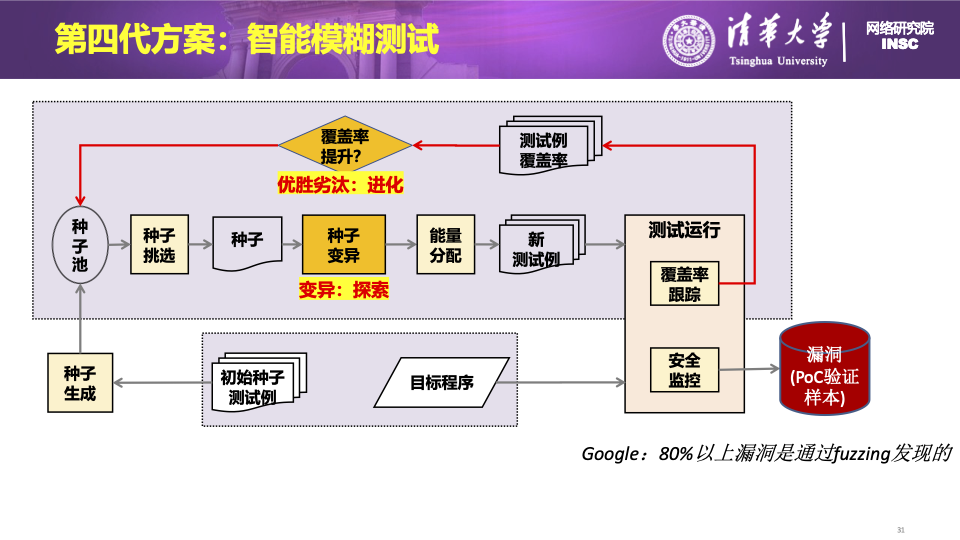

### **论文分享: Tardis: Coverage-Guided Embedded Operating System Fuzzing**

##### 

---

## 目录

1. 背景和挑战
2. 设计目标
3. 具体设计
4. 实验
5. 相关工作

---

## 背景和挑战

当前的基于覆盖率的fuzz方法，为什么不能直接用于embedded os？

- **Architecture**: Embedded OSs run on a variety of architectures and platforms
- **Intercafes**: fuzzer对OS的功能有一定依赖，很多Embedded OSs do not support the complete suite of interfaces required. Meanwhile, different Embedded OSs normally provide different interfaces for user land, thus a unified, OS-agnostic design is needed for coverage collection
- **Efficiency**: be efficient so that they would not significantly impact the execution throughput of the fuzzer

---

### 设计目标

- the coverage feedback mechanisms should be **software-based** and avoid relying on hardware-specific mechanisms to guarantee portability. 
- these mechanisms should be **OS-agnostic**, i.e., it is able to operate without relying on any OS-specific features and can adapt to different OSes without additional costs.
- the mechanisms’ implementations should be **highly efficient** and avoid introducing any significant overheads. 因为embedded OS对效率要求比较高

---

## 具体设计

---

## 具体设计

两个关键的技术问题：
- 关于输入数据的自动调整算法，如何根据覆盖率反馈的结果，效率更高地生成触发新的执行路径的输入
- 覆盖率的部分，如何得到程序覆盖率，并且反馈给fuzzer，fuzzer再如何将分析结果交给上一步说的输入数据自动调整算法部分，用来指导后续的fuzz

---
## 具体设计
更加具体一点，想要收集程序覆盖率并且得到反馈，分为以下几个步骤：
1. coverage initialization。将被测试的代码划分为很多个基本块，并且通过回调函数，使得这个基本块如果被执行，那么就会调用另外一个用来统计基本块执行次数的函数
2. 覆盖率统计。不仅要知道这个基本块有没有被执行过，还希望知道这个执行路径有没有被执行过
3. coverage analyse。fuzzer希望能够以一个比较高的效率知道，相比之前的输入，是否有覆盖到新的执行路径

---
## Coverage Initialization
现有的用户态fuzzing编译器插桩技术是如何做的：
- the Clang compiler supports a general instrumentation mechanism that can **inject user-defined callbacks** at the beginning of each code block. The callback **pc_trace_guard_init()** is used to initialize the whole collection procedure and **is called before entering program logic**, while the callback **pc_trace_guard()** is invoked at the entry site of each basic block for code branch collection.
- the pc_trace_guard_init() assigns ID numbers to each basic block for identification

---

## Coverage Initialization

为什么现有的技术不能被直接用于嵌入式系统？
- for an user land program, **pc_trace_guard_init()** is invoked by a special instrumented function **__sanitizer_cov_module_init()**, which is called before entering each module of the program.
- the variety of compilation environments and the diverse implementation strategies lead to a diverse runtime model and inadequate compilation supports

---

## Coverage Initialization

解决方案：
a **dynamic initialization mechanism, independent of both target architecture and target kernel**

1. the target OS’s source code will be compiled into an ELF image.
2. for a function that needs to be invoked, we need to pinpoint the exact position of the function.(**disassemble**)
3. implement an indirect call to it during OS startup through a **function pointer**

---
## OS Agnostic Coverage Collection

现有的coverage collection是如何做的？

Existing coverage collection tools, e.g., **KCOV**, utilizing sophistical services from target OS, e.g., mmap, fopen, etc.,

解决方案：
collect coverage statistics with several simple binary instruments like bitwise
（不管KCOV这种成熟技术了，自创一些解决方案）

---
## OS Agnostic Coverage Collection

解决思路（基础版）：

To calculate this hit count, we first need to identify which edges a test case covers. Intuitively, we can give each edge a hash number based on its previous and current basic blocks.

存在的问题：
- edge's direction information may loss
- hash操作开销太大

---
## OS Agnostic Coverage Collection
解决思路（升级版）：

- previous-block-ID xor current-block-ID
- shift the previous basic block ID by one bit to the right after execution so that we can distinguish between onward and backward control flow

好处：
- 同时记录了block-ID、direction信息
- xor和shift开销都很小

---

## Coverage Analysis

遇到的问题：
1. 希望在host端完成analysis过程，但是覆盖率数据是在QEMU VM跑的被测试的OS中得到的
2. 希望提高分析效率: coverage comparison is **a frequent operation** that must be performed after each input’s execution.

---

## Coverage Analysis

1. **shared coverage buffer**: Tardis proposes using **a shared coverage buffer** to store the coverage information so that it can be accessed on both the guest side and host side directly. (by **shared memory mechenism**)

2. **Efficient Analysis**: a compact bitmap to record the global coverage and check for new recovery.
- 64KB bitmap（这样就可以放进L2 cache）
- 对hit count做hash，每个hit count不超过8bit

（这段没明白，是对每条边都做还是？）

---

## 实验部分

实验环境：
1) UC/OS [13]; 
2) FreeRTOS [2]; 
3) Rt-Thread [33]; and 
4) Zephyr [15]
The experiments were conducted on a Linux server with 64 GB of memory and a 16-core CPU

---

## 实验部分

1) RQ1：Tardis是否能够揭示不同嵌入式操作系统中的新漏洞？
经过测试，发现了17个previously unknown bugs

2) RQ2：与黑盒模糊测试相比，Tardis的覆盖率指导机制是否有效地实现了更高的代码覆盖率？
为了测试coverage guide的效率，用Tardis和裁剪掉coverage guide的Tardis进行对比。

3) RQ3：在模糊测试期间，插桩给Tardis带来了哪些开销？
内存：不同的OS效率不同，大概10%-40%。时间：也是30%左右。
测试方法：选择了不同的测试用例，测试插桩前和插桩后的运行时间差。

---

## RELATED WORK

##### kernel fuzzing相关

- syzkaller，以及自动生成system call description的工作，例如Healer。HFL[11] 采用symbolic execution来生成高质量输入来触发新的内核代码执行路径。
- GPOS fuzzing：
    - Gustave，
    - KAFL：使用Intel-PT来支持coverage-guided fuzzing，在architecture上有限制
    - Rtkaller: 开源https://github.com/Rrooach/Rtkaller 。based on Syzkaller, currently only support rt-Linux fuzzing, can not be adapted to other Embedded OS scenarios。

---

## RELATED WORK

##### Instrumentation in Fuzzing

没有coverage guidedance的fuzz效率比较有限，因此收集coverage非常重要。现有的coverage collection方案：
- SanitizerCoverage：SanitizerCoverage offers function level, basic block level, and edge level coverage information
- AFL-GCC：AFL provides edge level coverage only

---

## RELATED WORK
##### Main Differences between general purpose OS fuzzing and Embedded OS fuzzing
大多数coverage-guided kernel fuzzer需要比较完整的existing infrastructures, such as standard APIs and uniform memory layouts.但是Embedded OSs可能并不能对fuzzer提供这些支持。

Gustave and KAFL that enable coverage-guided fuzzing of certain Embedded OS by heavily modified QEMU and introducing the binary instrumentation，但是这样做开销太大。

---

<!-- _class: lead -->

<!-- _paginate: false -->

<!-- _backgroundImage: url('./figures/hero-background.svg') -->

# Thanks!
